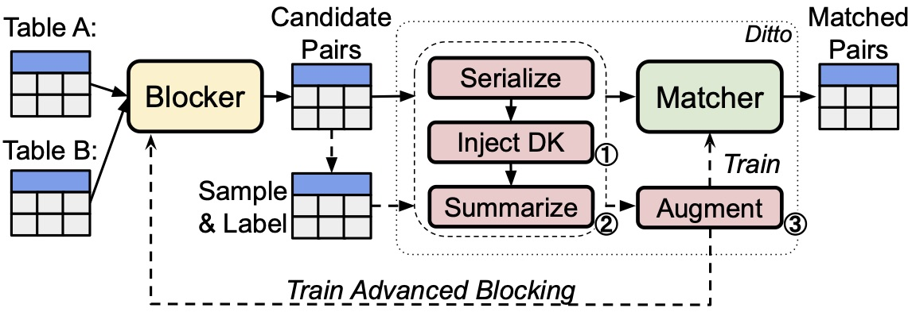

# Ditto: Deep Entity Matching with Pre-Trained Language Models

*Update: a new light-weight version based on new versions of Transformers*

Ditto is an entity matching (EM) solution based on pre-trained language models such as BERT. Given a pair of data entries, EM checks if the two entries refer to the same real-world entities (products, businesses, publications, persons, etc.). Ditto leverages the powerful language understanding capability of pre-trained language models (LMs) via fine-tuning. Ditto serializes each data entry into a text sequence and casts EM as a sequence-pair classification problem solvable by LM fine-tuning. We also employ a set of novel optimizations including summarization, injecting domain-specific knowledge, and data augmentation to further boost the performance of the matching models.

For more technical details, see the [Deep Entity Matching with Pre-Trained Language Models](https://arxiv.org/abs/2004.00584) paper.

## Requirements

* Python 3.7.7
* PyTorch 1.9
* HuggingFace Transformers 4.9.2
* Spacy with the ``en_core_web_lg`` models
* NVIDIA Apex (fp16 training)

Install required packages
```
conda install -c conda-forge nvidia-apex
pip install -r requirements.txt
python -m spacy download en_core_web_lg
```

## The EM pipeline

A typical EM pipeline consists of two phases: blocking and matching. 

The blocking phase typically consists of simple heuristics that reduce the number of candidate pairs to perform the pairwise comparisons. Ditto optimizes the matching phase which performs the actual pairwise comparisons. The input to Ditto consists of a set of labeled candidate data entry pairs. Each data entry is pre-serialized into the following format:
```
COL title VAL microsoft visio standard 2007 version upgrade COL manufacturer VAL microsoft COL price VAL 129.95
```
where ``COL`` and ``VAL`` are special tokens to indicate the starts of attribute names and attribute values. A complete example pair is of the format
```
<entry_1> \t <entry_2> \t <label>
```
where the two entries are serialized and ``<label>`` is either ``0`` (no-match) or ``1`` (match). In our experiments, we evaluated Ditto using two benchmarks:
* the [ER_Magellan benchmarks](https://github.com/anhaidgroup/deepmatcher/blob/master/Datasets.md) used in the [DeepMatcher paper](http://pages.cs.wisc.edu/~anhai/papers1/deepmatcher-sigmod18.pdf). This benchmark contains 13 datasets of 3 categories: ``Structured``, ``Dirty``, and ``Textual`` representing different dataset characteristics. 
* the [WDC product matching benchmark](http://webdatacommons.org/largescaleproductcorpus/v2/index.html). This benchmark contains e-commerce product offering pairs from 4 domains: ``cameras``, ``computers``, ``shoes``, and ``watches``. The training data of each domain is also sub-sampled into different sizes, ``small``, ``medium``, ``large``, and ``xlarge`` to test the label efficiency of the models. 

We provide the serialized version of their datasets in ``data/``. The dataset configurations can be found in ``configs.json``. 

## Training with Ditto

To train the matching model with Ditto:
```
CUDA_VISIBLE_DEVICES=0 python train_ditto.py \
  --task Structured/Beer \
  --batch_size 64 \
  --max_len 64 \
  --lr 3e-5 \
  --n_epochs 40 \
  --lm distilbert \
  --fp16 \
  --da del \
  --dk product \
  --summarize
```
The meaning of the flags:
* ``--task``: the name of the tasks (see ``configs.json``)
* ``--batch_size``, ``--max_len``, ``--lr``, ``--n_epochs``: the batch size, max sequence length, learning rate, and the number of epochs
* ``--lm``: the language model. We now support ``bert``, ``distilbert``, and ``albert`` (``distilbert`` by default).
* ``--fp16``: whether train with the half-precision floating point optimization
* ``--da``, ``--dk``, ``--summarize``: the 3 optimizations of Ditto. See the followings for details.
* ``--save_model``: if this flag is on, then save the checkpoint to ``{logdir}/{task}/model.pt``.

### Data augmentation (DA)

If the ``--da`` flag is set, then ditto will train the matching model with MixDA, a data augmentation technique for text data. To use data augmentation, one transformation operator needs to be specified. We currently support the following operators for EM:


| Operators       | Details                                           |
|-----------------|---------------------------------------------------|
|del              | Delete a span of tokens                      |
|swap             | Shuffle a span of tokens                          |
|drop_col         | Delete a whole attribute                          |
|append_col       | Move an attribute (append to the end of another attr) |
|all              | Apply all the operators uniformly at random    |

### Domain Knowledge (DK)

Inject domain knowledge to the input sequences if the ``--dk`` flag is set. Ditto will preprocess the serialized entries by
* tagging informative spans (e.g., product ID, persons name) by inserting special tokens (e.g., ID, PERSON)
* normalizing certain spans (e.g., numbers)
We currently support two injection modes: ``--dk general`` and ``--dk product`` for the general domain and for the product domain respectively. See ``ditto/knowledge.py`` for more details.

### Summarization
When the ``--summarize`` flag is set, the input sequence will be summarized by retaining only the high TF-IDF tokens. The resulting sequence will be of length no more than the max sequence length (i.e., ``--max_len``). See ``ditto/summarize.py`` for more details.

## To run the matching models
Use the command:
```
CUDA_VISIBLE_DEVICES=0 python matcher.py \
  --task wdc_all_small \
  --input_path input/input_small.jsonl \
  --output_path output/output_small.jsonl \
  --lm distilbert \
  --max_len 64 \
  --use_gpu \
  --fp16 \
  --checkpoint_path checkpoints/
```
where ``--task`` is the task name, ``--input_path`` is the input file of the candidate pairs in the jsonlines format, ``--output_path`` is the output path, and ``checkpoint_path`` is the path to the model checkpoint (same as ``--logdir`` when training). The language model ``--lm`` and ``--max_len`` should be set to the same as the one used in training. The same ``--dk`` and ``--summarize`` flags also need to be specified if they are used at the training time.

## Colab notebook

You can also run training and prediction using this colab [notebook](https://colab.research.google.com/drive/1eyQbockBSxxQ_tuW5F1XKyeVOM1HT_Ro?usp=sharing).
